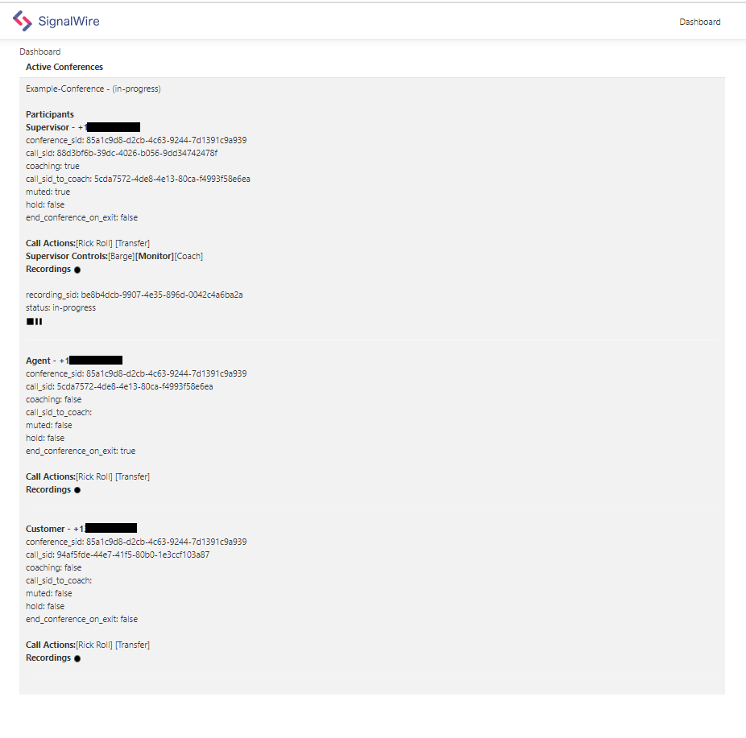

# Snippets Coaching
This snippet will show you how to use Coaching and Recording features.
## About Coaching
Learn how to implement conference controls, that are the foundation to many call center implementations.



## Getting Started
You will need a machine with Node installed, the SignalWire SDK, a provisioned SignalWire phone number, and optionaly Docker if you decide to run it in a container.

For this demo we will be using Node, but more languages may become available.

- [x] Node
- [x] Express
- [x] SignalWire SDK
- [x] SignalWire Phone Number
- [x] Docker (Optional)
----
## Running Coaching - How It Works
When your Signalwire number receives an incoming voice call to the /inbound endpoint, Signalwire will dial the predefined agent phone number as specified in the enviroment file, and then once the agent is connected, will connect the supervisor to the call.

Let's setup your Node.js enviroment with Express for handle web requests.

On the command line in your current directory, run the following command:

To install Signalwire SDK via NPM (Node Package Manager)
```
npm install @signalwire/node
```
To install express via NPM (Node Package Manager)
```
npm install express
```

To build your react components run
```
npm run build
```

To run the example, and start the express server run the following command.
The server will run on port 5000, you can change the port in the code if you wish.
```
node server.js
```
You can now load the dashboard by visiting your hostname on port 5000, and as you make calls they will appear on the dashboard.
i.e. http://myhost:5000 
 
## Methods and Endpoints

```
Endpoint: /inbound
Methods: GET OR POST
This endpoint handles incoming call, and will spawn a call to an agent and a supervisor.
```
```
Web API Endpoints: 

// updates an in progress conference.
/api/conferences/update

// updates an in progress call
/api/calls/update

// entry for dashboard
/api/dashboard

// helper for demo, keeps track of caller role i.e. agent, supervisor, customer
/api/helpers/lookupCaller

// start recording
/api/recordings/start

// stop recording
/api/recordings/stop

// resume recording
/api/recordings/resume

// List recording for a call
/api/recordings/list

// Get Participants for call
/api/participants
```
## Setup Your Enviroment File

1. Copy from example.env and fill in your values
2. Save new file callled .env

Your file should look something like this
```
## This is the full name of your SignalWire Space. e.g.: example.signalwire.com
SIGNALWIRE_SPACE=
# Your Project ID - you can find it on the `API` page in your Dashboard.
SIGNALWIRE_PROJECT=
# Your API token - you can generate one on the `API` page in your Dashboard
SIGNALWIRE_TOKEN=
# The phone number you'll be using for this Snippets. Must include the `+1` , e$
INBOUND_NUMBER=
# The phone number you'll be using for this Snippets. Must include the `+1` , e$
AGENT_NUMBER=
# The phone number you'll be using for this Snippets. Must include the `+1` , e$
SUPERVISOR_NUMBER=
# Hostname, the ip address or Fully Qualified Domain Name of your host and port, for routing action urls
HOSTNAME=

```
## Build and Run on Docker
Lets get started!
1. Use our pre-built image from Docker Hub 
```
For Node:
docker pull signalwire/snippets-coaching:node
```
(or build your own image)

1. Build your image
```
docker build -t snippets-coaching .
```
2. Run your image
```
docker run --publish 5000:5000 --env-file .env snippets-coaching
```
3. The application will run on port 5000

## Build and Run Natively
For Node
```
1. Replace environment variables
2. From command line run, node server.js
```

----
# More Documentation
You can find more documentation on LaML, Relay, and all Signalwire APIs at:
- [SignalWire Node SDK](https://github.com/signalwire/signalwire-node)
- [SignalWire API Docs](https://docs.signalwire.com)
- [SignalWire Github](https://gituhb.com/signalwire)
- [Docker - Getting Started](https://docs.docker.com/get-started/)
- [Node - Gettings Started](https://nodejs.org/en/docs/guides/getting-started-guide/)

# Support
If you have any issues or want to engage further about this Signal, please [open an issue on this repo](../../issues) or join our fantastic [Slack community](https://signalwire.community) and chat with others in the SignalWire community!

If you need assistance or support with your SignalWire services please file a support ticket from your Dashboard. 

